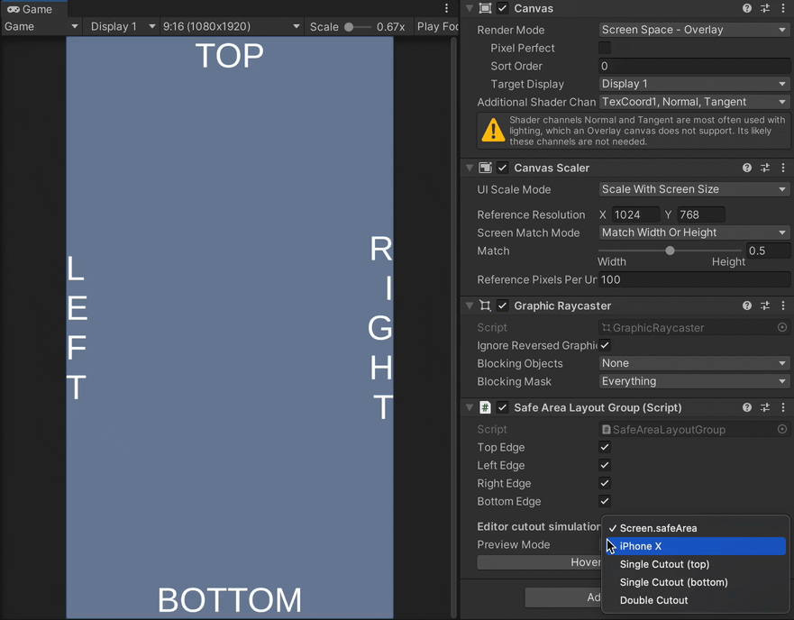

# Safe Area Layout
[](https://openupm.com/packages/com.gilzoide.safe-area-layout/)

Unity GUI [layout group](https://docs.unity3d.com/Packages/com.unity.ugui@1.0/manual/UIAutoLayout.html#layout-groups)
that makes children respect the [Safe Area](https://docs.unity3d.com/ScriptReference/Screen-safeArea.html).
It drives direct children's anchors while in Play Mode and supports [`LayoutElement.ignoreLayout`](https://docs.unity3d.com/Packages/com.unity.ugui@1.0/api/UnityEngine.UI.ILayoutIgnorer.html).



## Features
- Fully integrated with Unity GUI's layout system: only rebuilds the layout when needed, no `Update` method or coroutines attached
- Does not resize it's own `RectTransform`, so it can be used in objects with a `Canvas` component directly
- Does not demand a full screen `RectTransform`: the script detects where your rect overlaps with the Safe Area and updates accordingly
- Ignore children using a `IgnoreSafeArea` component or `LayoutElement` with `Ignore Layout` marked as true.
  Useful for background images, for example.
- Preview Safe Area adjustments in Editor using any of the Preview Modes in `SafeAreaLayoutGroup`'s inspector while hovering the `Hover to Preview Layout` button or while in Play Mode.
  All Preview Modes support both portrait and landscape resolutions.
  `Screen.safeArea` Preview Mode is only applied when using Unity's [Device Simulator](https://docs.unity3d.com/Manual/device-simulator-introduction.html) (in Unity 2020 and older, available as an [UPM package](https://docs.unity3d.com/Packages/com.unity.device-simulator@latest/index.html))
- Only affects canvases in either `Screen Space - Overlay` or `Screen Space - Camera` modes, so `World Space` canvases are ignored


## Installing
Either:

- Install using [openupm](https://openupm.com/):
  ```
  openupm add com.gilzoide.safe-area-layout
  ```

- Install via [Unity Package Manager](https://docs.unity3d.com/Manual/upm-ui-giturl.html)
using the following git URL:
  ```
  https://github.com/gilzoide/unity-safe-area-layout.git#1.0.2
  ```

- Clone this repository directly to your `Packages` folder or anywhere inside your project's `Assets`.


## Sample
A sample scene is available at  [Samples~/SimpleSample](Samples~/SimpleSample).


## How to use
1. Add the [SafeAreaLayoutGroup](Runtime/SafeAreaLayoutGroup.cs) script anywhere in your UI hierarchy, even objects with `Canvas` components are supported.
   Direct children will have their anchors driven while the script is enabled.
2. (optional) Select the Safe Area edges that your layout group will respect.
3. (optional) Make specific children be ignored by the layout group by adding the `IgnoreSafeArea` component to them.
   Alternatively, use `LayoutElement` components with the `Ignore Layout` flag marked as true.
4. (optional) Use one of the Preview Modes while in editor to preview the adjustments.
   Preview is applied on Play Mode and while hovering the `Hover to Preview Layout` button in the `SafeAreaLayoutGroup`'s inspector.
5. Play the game (play the game, everybody play the gaaaame)
6. Enjoy 🍾
